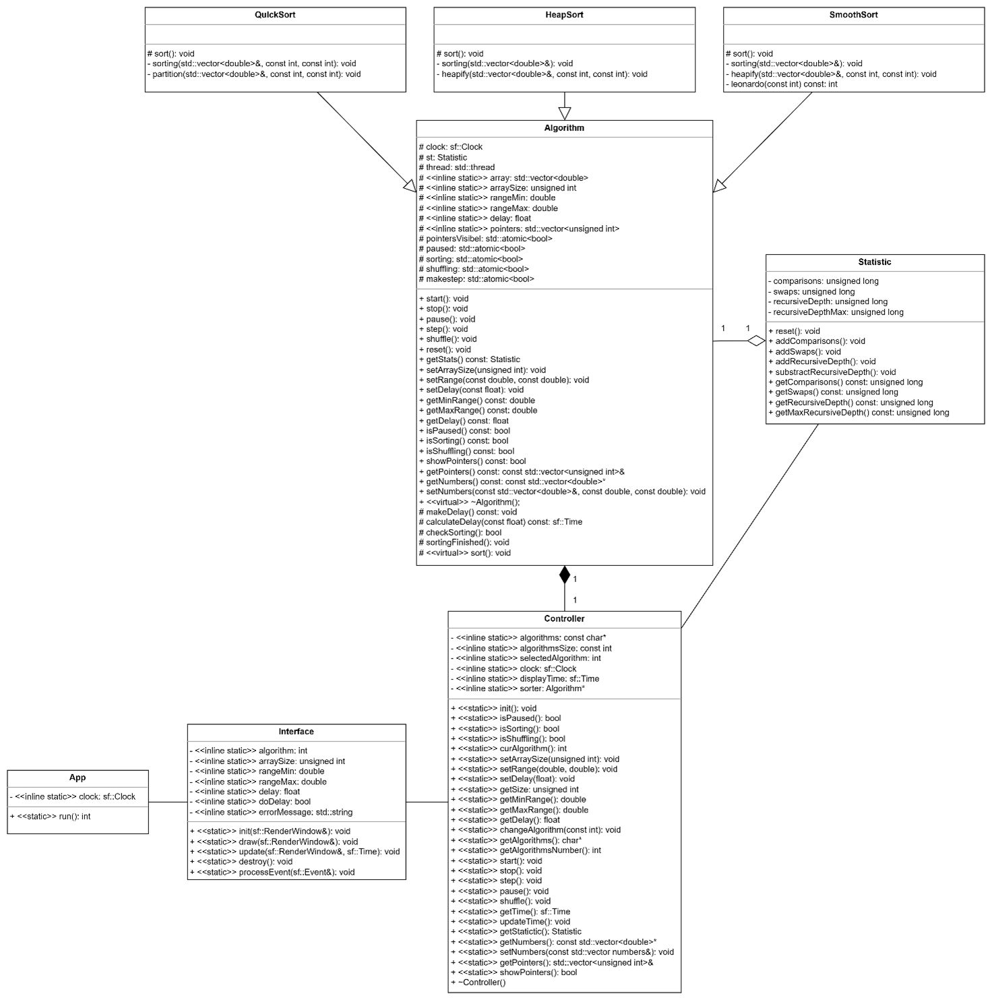
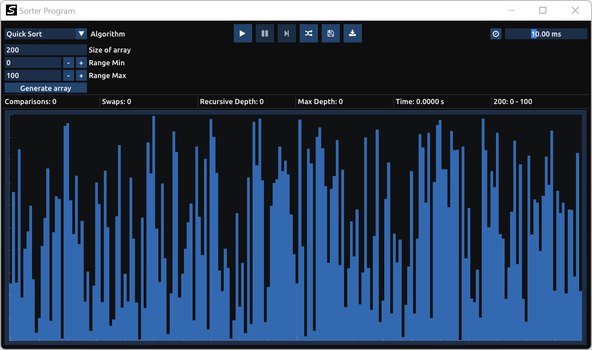
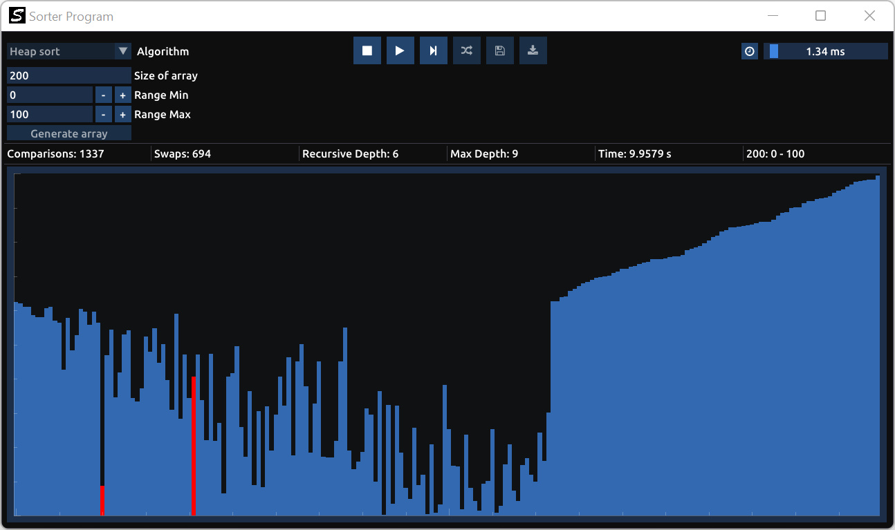
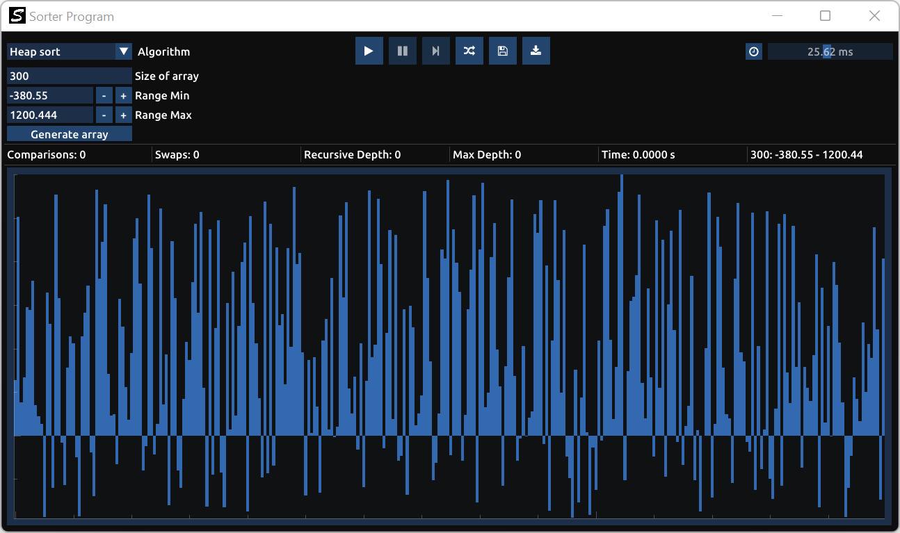
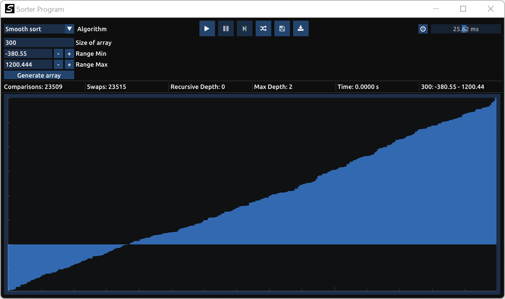

# Sorting Algorithms Visualizer

Visualizer of C++ sorting algorithms using ImGui, ImPlot and SFML. It visualizes quicksort, heapsort, and smoothsort algorithms with a given array size and range of double values.

## UML Class Diagram

## Screenshots

## Video preview
https://github.com/Maximax67/Sorting-Algorithms-Visualizer/assets/40457162/aa5cde5d-c5ce-4138-a1be-715d8b1d197b
